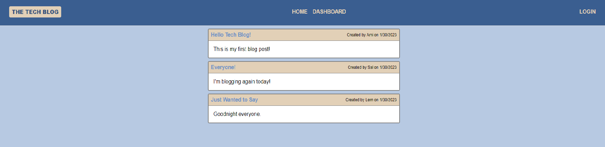
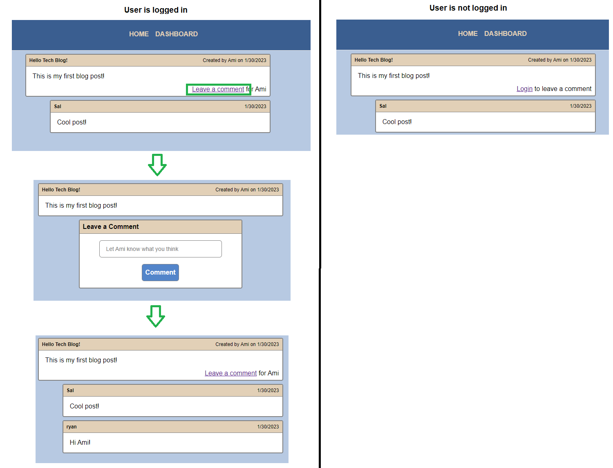
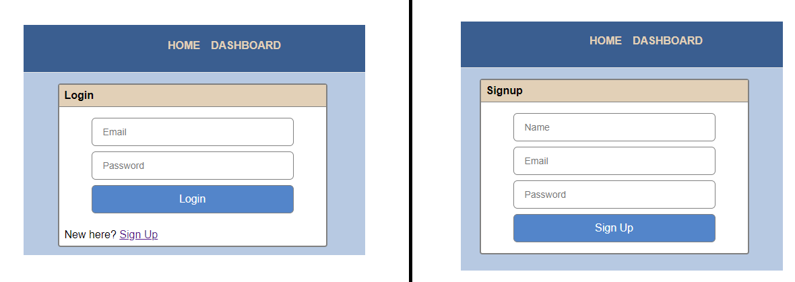
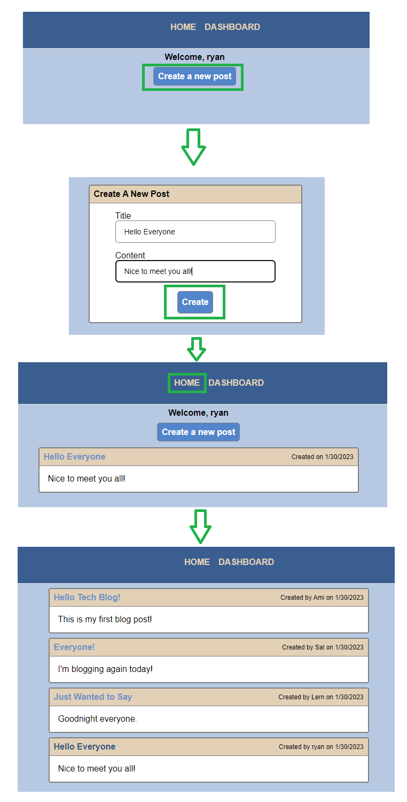
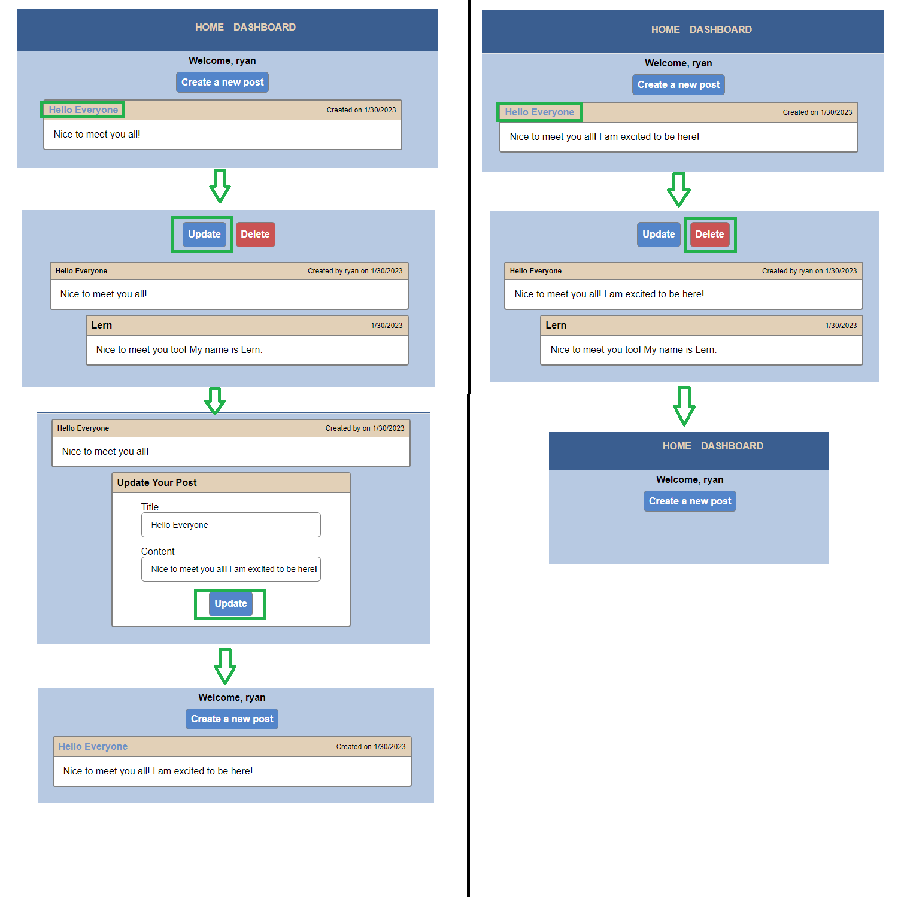

# Tech-Blog

## Description

The motivation for this project was to explore building a full-stack web application using the Model-View-Controller paradigm. This project uses MVC to build a blogging website. Users are able to sign up, create their own blog posts, view other users' posts, and leave comments for the other bloggers. By building this project, I further soldified my knowledge of using sequelize, MySQL2, and express for creating a website back-end. I also gained experience using express-handlebars and express-session for managing the front-end application, along with the user login statuses. 

The deployed project can be viewed through the following link: https://tech-blog-ryanafernandez.herokuapp.com/

## Table of Contents

- [Installation](#installation)
- [Usage](#usage)
- [License](#license)
- [Contributing](contributing)
- [Questions](#questions)

## Installation

This project uses the following node modules:
- bcrypt ^5.1.0
- connect-session-sequelize ^7.1.5
- dotenv ^16.0.3
- express ^4.18.2
- express-handlebars ^6.0.6
- express-session ^1.17.3
- mysql2 ^3.0.0
- sequelize ^6.28.0

The dotenv module manges the 'DB_NAME', 'DB_USER', and 'DB_PASSWORD' environment variables that are used in 'config/connection.js'. To configure the environment variables, create a '.env' file in the root project directory and provide the variable definitions there.

The command 'npm i' can be ran to install Node Package Manager, along with the above modules.

The schema.sql file in the 'db' directory contains SQL queries for initializing database.

## Usage

Before running the application, the database needs to be initialized with the SQL commands that are listed in 'schema.sql'. The initialized database and the database name in the .env file must match.

Once initialized, the database can be seeded with data by running 'npm run seed'. 

To run the server, use the command 'node server.js'.

Once the server is running and seeded with data, the user is presented with a homepage that displays all of the listed blog posts contained in the database. The navbar at the top of the page includes links for the homepage, the user dashboard, and the login page.

By clicking on an existing blog post, the user is able to view the post and any associated comments. Users may leave comments for the viewed post, but must be logged in to do so. If not logged in, the user will be prompted to log in, or redirected if their current session has expired.

The login link in the navbar will direct the user to the login page. The user may login using their email and password. The page also contains a link for new users to sign up.

Upon either logging in or signing up, the user is then directed to their dashboard. On their dashboard, the user is presented with all of their existing posts, along with a button for creating a new post. Clicking the create button links to a new page where the user is presented with a form for creating their post, requiring a title and content for the blog post. Once created the user is redirected to their dashboard. The new post is also viewable from the home page.

The user may also click on one of their existing posts to view the selected post and any associated comments. They also have the option to update or delete the post. Upon updating or deleting a post, user is returned to their dashboard.

## License

n/a

## Contributing

n/a

## Questions

If you have any questions about the repo, open an issue or contact me directly at ryanfernandez11@gmail.com. You can find more of my work at [my GitHub page](https://github.com/ryanafernandez/).
